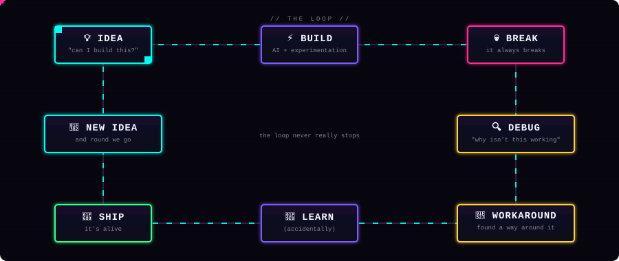

<div align="center">

<!-- 🔧 REPLACE: put your pixel-art avatar at assets/avatar.png (square image, 200–300px works best) -->


<br/><br/>

<!-- animated hero: CRT terminal, glitch title, typewriter lines, floating pixels -->


</div>


## 🧭 currently building

<div align="center">

| 🌐 web apps | 🤖 AI tools | 📱 APKs | 🎮 game dev | 🧊 3D / WebGPU | ⚙️ automation |
|:---:|:---:|:---:|:---:|:---:|:---:|
| shipping | tinkering | building | prototyping | breaking things | wiring it all together |

</div>

<!-- 🔧 living status — update this row whenever your actual focus shifts -->


## 🔁 how i build

<div align="center">

<!-- animated loop diagram: neon panels + a traveling pulse that runs the cycle continuously -->


</div>

<p align="center"><i>started with copy-pasting HTML, somehow ended up here.</i></p>


## 🏗️ projects

<!--
  🔧 REPLACE every href="#" and description below with the real thing —
  nothing here is invented, these are placeholders for you to fill in.
-->

<table>
<tr>
<td width="50%" valign="top">

### 🏴‍☠️ OnlyUs
_placeholder description — replace with what this actually does_

[repo →](#)

</td>
<td width="50%" valign="top">

### 🛠️ ExeToolz
_placeholder description — replace with what this actually does_

[repo →](#)

</td>
</tr>
<tr>
<td width="50%" valign="top">

### ⚔️ Rockboys
_placeholder description — replace with what this actually does_

[repo →](#)

</td>
<td width="50%" valign="top">

### 🧪 game dev experiments
_placeholder description — replace with what this actually does_

[repo →](#)

</td>
</tr>
</table>

<!-- 🔧 add more cards here using the same table pattern -->


## 🧰 things i've played with

<div align="center">

<!-- animated arcade-style loading bars, staggered fill on load -->


</div>


## 🧠 my approach

I don't always learn something first and then build.
Sometimes I build first, and learn whatever breaks along the way.

No roadmap. No structured learning path. Just an idea, a keyboard, and a willingness to find out why it isn't working at 1am.


## 📊 github activity

<!-- 🔧 REPLACE "RahulExe69" in every URL below with your real GitHub handle -->

<div align="center">


<br/>


<br/>


</div>


## 🥚 a small easter egg

<details>
<summary><code>$ whoami</code> <sub>(click to run)</sub></summary>
<br>

```bash
$ whoami
rahul

$ cat ./philosophy.txt
idea > plan
build > tutorial
"why the hell isn't this working" > 90% of my commit history

$ git log --oneline -3
a1b2c3d fix the fix from yesterday
9f8e7d6 it works now, don't ask how
1234abc initial idea, no plan
```

<!-- 🔧 swap the fake commit lines for real ones if you want it to be true, not just funny -->

</details>


<div align="center">

started with copy-pasting HTML.
still figuring things out.
just with bigger problems now. 😂

</div>

<br/>

<!-- ============================================================ -->
<!-- Everything below this line is setup notes for YOU, not for   -->
<!-- visitors — delete this whole block once you're set up, or    -->
<!-- leave it, it just won't render as anything meaningful in the -->
<!-- middle of the page since it's placed after the real content. -->
<!-- ============================================================ -->
